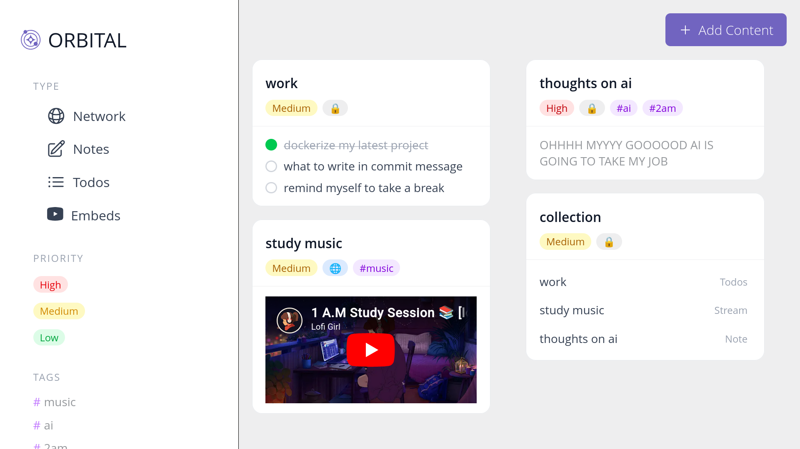
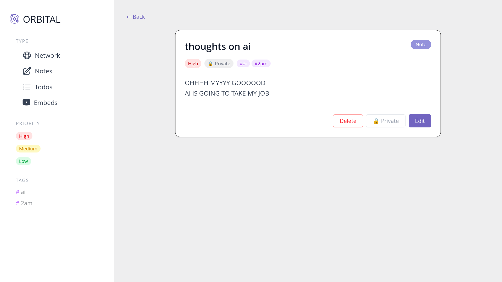
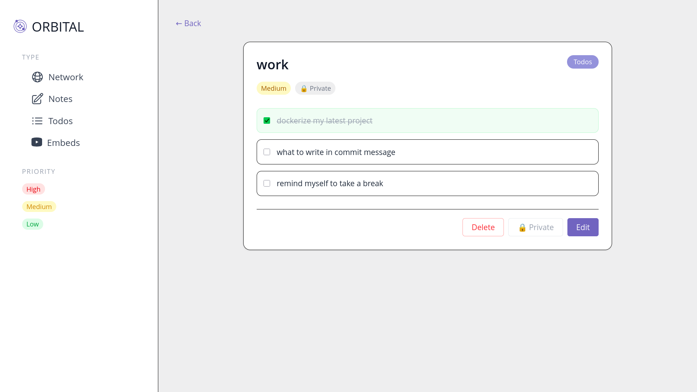
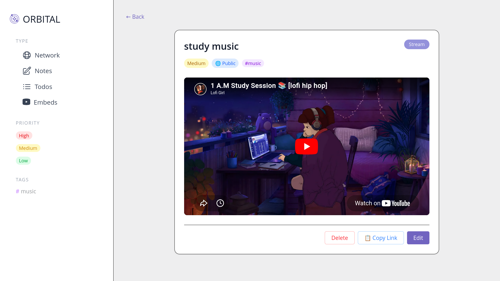
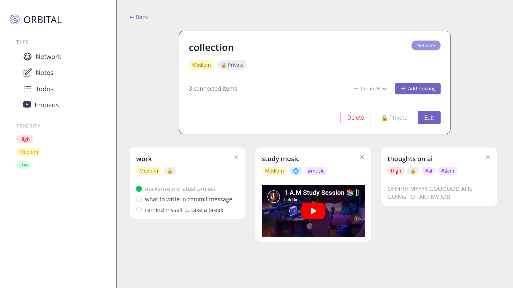

 Orbital

A modular, type-safe knowledge mapping app built with the MERN stack and TypeScript. Orbital lets you capture and connect ideas across multiple content types — notes, to-dos, YouTube embeds, and bookmarks — and organize them into deep, recursive networks.



---

## Features

- **4 content types** — Notes, To-dos, YouTube embeds, and Bookmarks under a single unified interface
- **Network of Networks** — Recursively connect any content into contextual maps; networks can contain other networks with zero data redundancy
- **Polymorphic data layer** — Mongoose discriminators keep heterogeneous models efficient and queryable
- **Zod validation** — End-to-end type safety across frontend and backend
- **Shareable content** — Generate public share links for any content item without requiring auth
- **Priority & tagging** — Label content by priority (high / medium / low) and tag freely for fast filtering
- **Responsive UI** — Works on mobile, tablet, and desktop with a collapsible sidebar

---

## Screenshots

### Dashboard


### Note


### To-do


### YouTube Embed


### Network


---

## Tech Stack

| Layer | Tech |
|---|---|
| Frontend | React, TypeScript, Tailwind CSS, React Router |
| Backend | Node.js, Express, TypeScript |
| Database | MongoDB, Mongoose |
| Validation | Zod |
| Auth | JWT |

---

## Getting Started

### Prerequisites
- Node.js 18+
- MongoDB instance (local or Atlas)

### Backend

```bash
cd backend
npm install
```

Create a `.env` file:

```env
MONGO_URI=your_mongodb_connection_string
JWT_SECRET=your_jwt_secret
PORT=5000
```

```bash
npm run dev
```

### Frontend

```bash
cd frontend
npm install
npm run dev
```

---

## API Documentation

Full API reference is available in the [backend README](./backend/README.md), covering:

- Auth routes — signup & signin
- Content CRUD — create, read, update, delete across all content types
- Share route — public access to shared content without auth

---

## Data Model

Each content item shares a base schema and extends it by `kind`:

```ts
// Base
{
  title: string
  kind: "note" | "stream" | "network" | "todos"
  priority: "high" | "medium" | "low"
  tags: string[]
  private: boolean
  userId: ObjectId
}

// note    → adds: note: string
// stream  → adds: link: string
// todos   → adds: todos: { text, done }[]
// network → adds: nodes: ObjectId[]  ← references other content items
```

---

## Architecture Highlights

**Mongoose Discriminators** — All content types live in one collection under a shared base schema. This cuts cross-type queries by ~50% compared to separate collections and keeps population simple.

**Recursive Networks** — A `network` item's `nodes` array can reference any content type, including other networks. This lets you build arbitrarily deep knowledge graphs without duplicating data.

**Zod across the stack** — The same schema definitions validate API request bodies on the server and form inputs on the client, so type errors surface at the boundary rather than silently at runtime.

---

## Roadmap

- [ ] Graph visualisation for networks
- [ ] Full-text search
- [ ] Collaborative editing
- [ ] Dark mode
- [ ] Mobile app

---